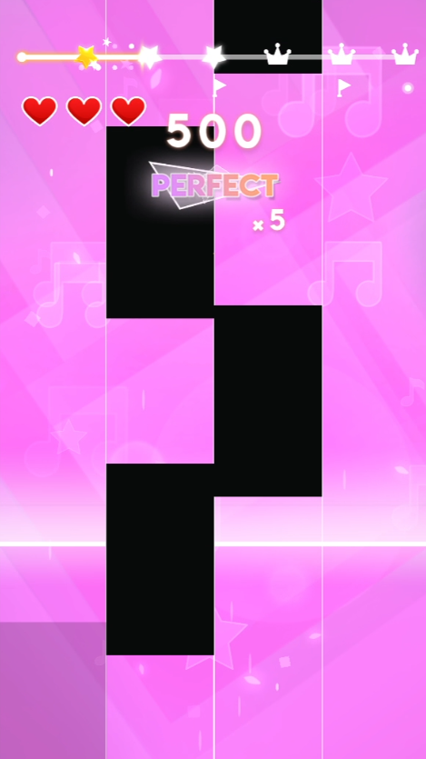

# Discord Night Piano Tiles Bot Challenge 🎹🤖

This Python script is a funny and competitive bot designed to help you dominate "Piano Tiles" during Discord night calls with friends. Using screen capturing, color recognition, and automated key presses, it ensures you'll outperform any human or bot competitors.

## Features
- **🎯 Real-Time Tile Detection**: Recognizes black, long, and purple tiles using color distance calculations.
- **⌨️ Automated Key Presses**: Simulates key presses (`F`, `G`, `H`, `J`) based on tile positions.
- **⚡ Dynamic Frame Processing**: Efficiently captures and processes screen data using `mss` and `numpy`.
- **🧵 Multithreaded Performance**: Detects tiles in parallel for smoother gameplay.
- **🚨 Anti-Stuck Mechanism**: Randomized inputs ensure the bot stays responsive even in tricky situations.
- **🔍 Debugging Tools**: Annotates screenshots to help verify tile recognition accuracy.
- **🎶 Auto Song Transition**: Detects when a song is completed and moves to the next one.

  

## Requirements
Install the following Python libraries:
```bash
pip install keyboard pyautogui mss opencv-python numpy
